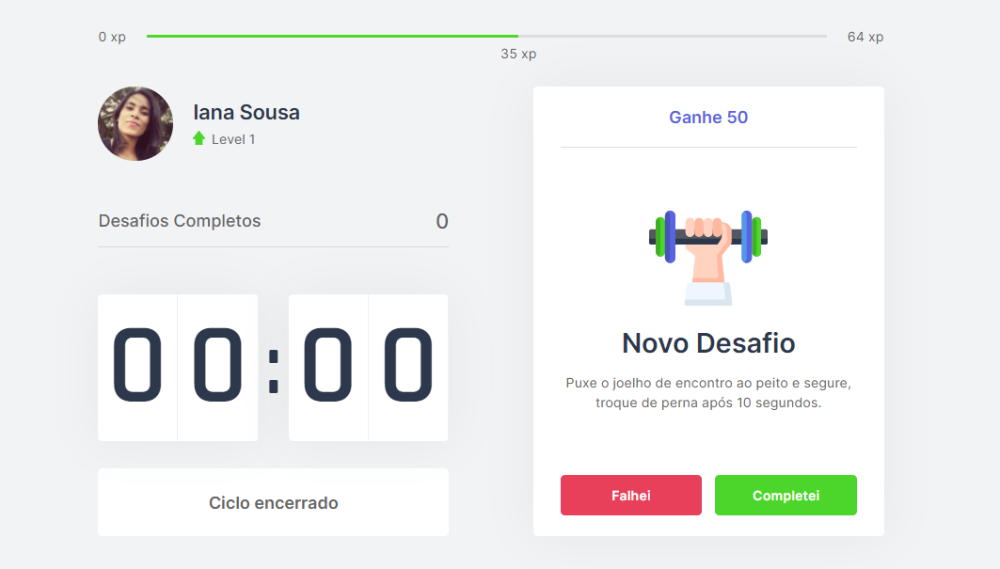

<h1 name="sobre">ℹ About the Project</h1>
Timer.on is a project that implements the Pomodoro technique, incorporating challenges to be completed during the breaks between concentration cycles.

To achieve this, a timer is used to divide work or study into 25-minute periods with short breaks in between. This allows for more effective time management and is ideal for those who struggle with concentration.

During the breaks, challenges will be proposed. Completing each challenge increases the level and earns points, making studying or working more enjoyable.

<h1 name="preview">:eyes: Project Preview</h1>
<h3>Web</h3>



<h1 name="run">:boom: How to Run the Project</h1> <br>

- ### **Prerequisites**

  - You **must** have **[Node.js](https://nodejs.org/en/)** installed on your computer.
  - You **must** have **[Git](https://git-scm.com/)** installed and configured on your computer.
  - You **must** have a package manager, either **[NPM](https://www.npmjs.com/)** or **[Yarn](https://yarnpkg.com/)**.

```bash
# Clone Repository
$ git clone https://github.com/IanaCris/timeron.git
```


<h3 name='website'>💻 Start the API</h3><br>

```bash
# Go to the folder
$ cd timeron

# Install the dependencies
$ yarn # ou npm install

# Start the API
$ yarn dev # ou npm run dev
```
Access the API at http://localhost:3000/ to see the website.


<h1 name="tecnologias">🛠 Technologies</h1>

The following tools were used to build the project:

- [React](https://pt-br.reactjs.org/)
- [TypeScript](https://www.typescriptlang.org/)
- [NextJS](https://nextjs.org/)
